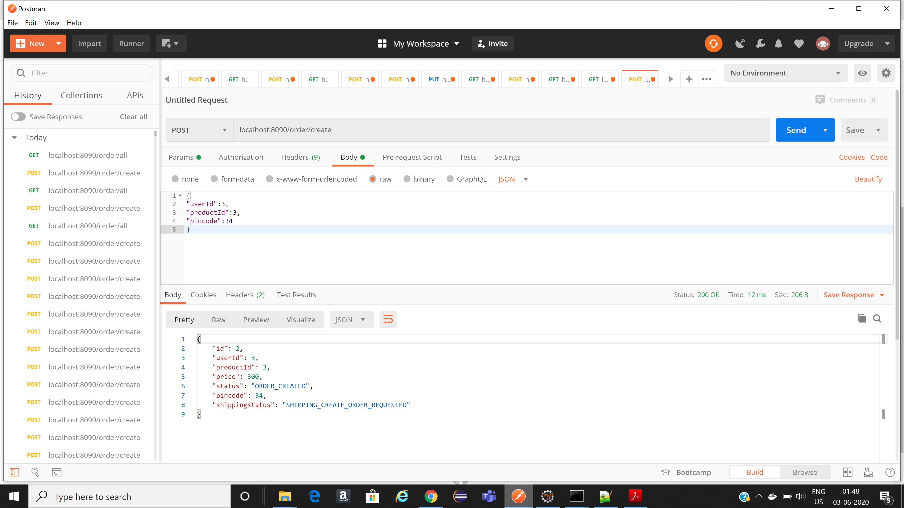
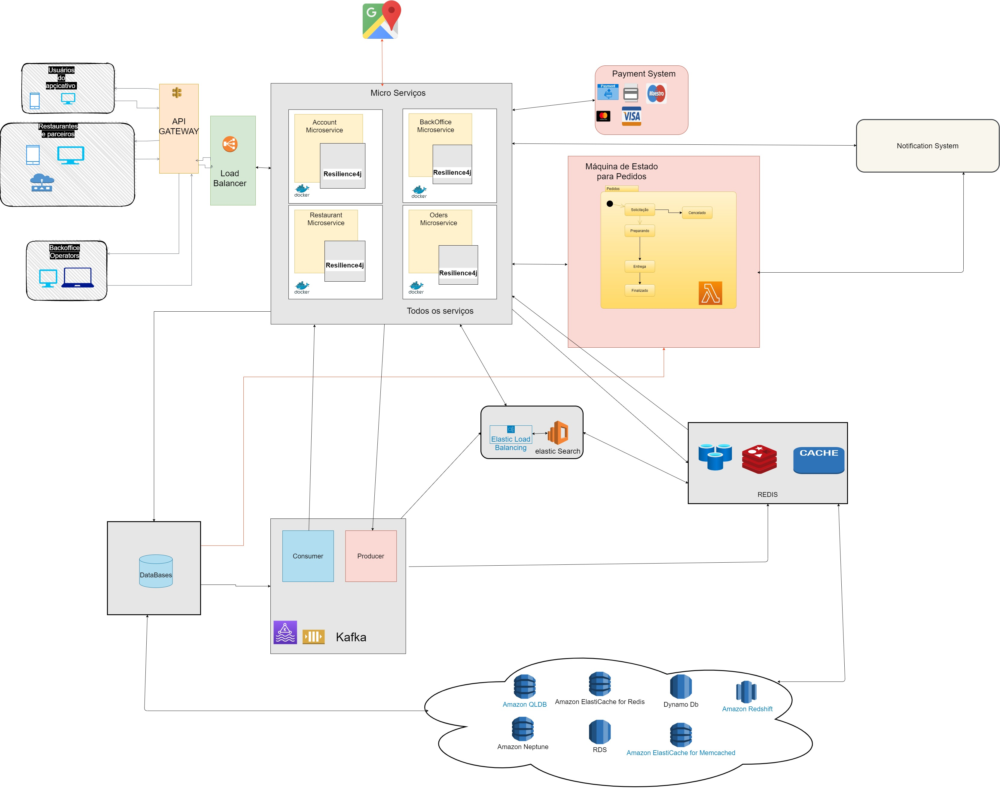

# fiap-desafio6-ifood

Pre-requisites:
Install Kafka
Install Spring
Install Java
Start Kafka server
Reconmfigure properties.yml


Docker Run
------------------
docker build -t fiap/ifood .
docker run -p 8090:8090 fiap/ifood


Create Order Request Image


Get All Order Request Image


 Project Code Flow Image


Architecture Proposal


```yml
Snippets from Application.yml 
spring.cloud.stream:
  function:
     definition: orderEventPublisher;shippingEventPublisher;orderEventProcessor;shippingEventProcessor;paymentEventConsumer;shippingEventConsumer
  bindings:
    orderEventPublisher-out-0:
      destination: order-events
    orderEventProcessor-in-0:
      destination: order-events
    orderEventProcessor-out-0:
      destination: payment-events
    paymentEventConsumer-in-0:
      destination: payment-events
    shippingEventPublisher-out-0:
      destination: shppingafterpayment-events  
    shippingEventProcessor-in-0:
      destination: shppingafterpayment-events
    shippingEventProcessor-out-0:
      destination: shipping-events
    shippingEventConsumer-in-0:
      destination: shipping-events
```

